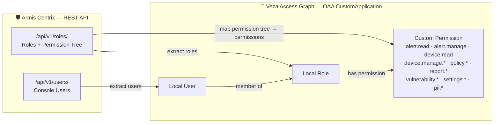

# Armis Centrix → Veza OAA Integration

## 1. Overview

This script models **Armis Centrix itself as an application** in Veza — mapping which console users exist, which roles they hold, and what actions each role permits.

The output answers: **"Who can do what inside the Armis platform?"**

| Source entity | Veza OAA entity | Notes |
|---|---|---|
| Console user | `local_user` | All users appear, including those with no role |
| Role (Admin, Read Only, etc.) | `local_role` | Identified by stable `roleId` |
| Permission (e.g. `alert.read`) | `permission` on `CustomApplication` | Flattened from Armis permission tree |
| User → role assignment | `local_user.add_role()` | Uses `roleAssignment` field (authoritative) |
| Role → permission | `local_role.add_permission(apply_to_application=True)` | |

**OAA permission mapping** (sample):

| Armis permission tree path | OAA permission name | OAA type |
|---|---|---|
| `alert.read.all` | `alert.read` | DataRead |
| `alert.manage.all` | `alert.manage` | DataWrite |
| `device.manage.create.all` | `device.manage.create` | DataCreate |
| `settings.secretKey.all` | `settings.secretKey` | Admin |
| `advancedPermissions.device.deviceNames.all` | `pii.deviceNames` | DataRead |

---

## 2. Entity Relationship Map



---

## 3. How It Works

1. Authenticate with Armis using a secret key → receive a short-lived access token
2. Paginate `GET /api/v1/users/` to collect all console users
3. Call `GET /api/v1/roles/` to collect all roles with their full permission trees
4. Define all 44 named permissions on the OAA `CustomApplication`
5. For each role: flatten the Armis permission tree recursively, map to OAA permission names, and call `add_permission(apply_to_application=True)` for each granted permission
6. For each user: create a `local_user`, set custom properties (`twoFactorAuthentication`, `enforceLoginViaCreds`, `reportPermissions`), and assign roles from `roleAssignment` (authoritative field)
7. Validate and push the OAA payload to Veza (or save as JSON for inspection)

---

## 4. Prerequisites

- Python 3.9+
- Network access to `https://<tenant>.armis.com`
- Network access to your Veza instance
- Armis secret key (from the Armis console → Settings → API)
- Veza API key with `OAA Push` permissions

---

## 5. Quick Start

```bash
curl -fsSL https://raw.githubusercontent.com/pvolu-vz/ArmisAppOaa/main/integrations/armis-centrix/install_armis-centrix.sh | bash
```

> Update the URL above once this repo is published.

---

## 6. Manual Installation

### RHEL / CentOS / Amazon Linux

```bash
sudo dnf install -y python3 python3-pip git curl
git clone https://github.com/pvolu-vz/ArmisAppOaa.git
cd ArmisAppOaa/integrations/armis-centrix
python3 -m venv venv
./venv/bin/pip install -r requirements.txt
cp .env.example .env && chmod 600 .env
# Edit .env with your credentials
```

### Ubuntu / Debian

```bash
sudo apt-get update && sudo apt-get install -y python3 python3-pip python3-venv git curl
git clone https://github.com/pvolu-vz/ArmisAppOaa.git
cd ArmisAppOaa/integrations/armis-centrix
python3 -m venv venv
./venv/bin/pip install -r requirements.txt
cp .env.example .env && chmod 600 .env
# Edit .env with your credentials
```

### .env configuration

```bash
ARMIS_TENANT=demo-veza             # subdomain only — no .armis.com suffix
ARMIS_SECRET_KEY=<your-secret-key>
VEZA_URL=https://company.vezacloud.com
VEZA_API_KEY=<your-veza-api-key>
```

---

## 7. Usage

```bash
# Dry-run (no Veza push) — inspect payload
./venv/bin/python3 armis-centrix.py --dry-run --save-json

# Push to Veza
./venv/bin/python3 armis-centrix.py

# Full options
./venv/bin/python3 armis-centrix.py --help
```

| Argument | Required | Values | Default | Description |
|---|---|---|---|---|
| `--env-file` | No | path | `.env` | Path to credentials file |
| `--armis-tenant` | Yes* | string | `ARMIS_TENANT` env | Armis subdomain |
| `--armis-secret-key` | Yes* | string | `ARMIS_SECRET_KEY` env | Armis secret key |
| `--veza-url` | Yes* | URL | `VEZA_URL` env | Veza instance URL |
| `--veza-api-key` | Yes* | string | `VEZA_API_KEY` env | Veza API key |
| `--provider-name` | No | string | `Armis` | Provider name in Veza |
| `--datasource-name` | No | string | `Armis Centrix` | Datasource name in Veza |
| `--dry-run` | No | flag | off | Skip Veza push |
| `--save-json` | No | flag | off | Save payload JSON |
| `--log-level` | No | DEBUG/INFO/WARNING/ERROR | `INFO` | Log verbosity |
| `--skip-sites` | No | flag | off | Skip sites enrichment |
| `--skip-boundaries` | No | flag | off | Skip boundaries enrichment |

*Required unless set in environment or `.env`.

---

## 8. Deployment on Linux

### Service account

```bash
sudo useradd -r -s /bin/bash -m -d /opt/armis-centrix-veza armis-centrix-veza
sudo mkdir -p /opt/VEZA/armis-centrix-veza/scripts /opt/VEZA/armis-centrix-veza/logs
sudo chown -R armis-centrix-veza: /opt/VEZA/armis-centrix-veza
sudo chmod 700 /opt/VEZA/armis-centrix-veza/scripts
sudo chmod 600 /opt/VEZA/armis-centrix-veza/scripts/.env
```

### SELinux (RHEL)

```bash
getenforce   # check mode
sudo restorecon -Rv /opt/VEZA/armis-centrix-veza/
```

### Cron (wrapper script)

```bash
# /opt/VEZA/armis-centrix-veza/run_armis_oaa.sh
#!/bin/bash
cd /opt/VEZA/armis-centrix-veza/scripts
./venv/bin/python3 armis-centrix.py >> ../logs/cron.log 2>&1
```

```
# /etc/cron.d/armis-centrix-veza
0 6 * * * armis-centrix-veza /opt/VEZA/armis-centrix-veza/run_armis_oaa.sh
```

### Log rotation

```
# /etc/logrotate.d/armis-centrix-veza
/opt/VEZA/armis-centrix-veza/logs/*.log {
    daily
    rotate 30
    compress
    missingok
    notifempty
}
```

---

## 9. Multiple Instances

To run against multiple Armis tenants, use separate `.env` files:

```bash
./venv/bin/python3 armis-centrix.py --env-file .env.tenant1 --datasource-name "Armis - Tenant 1"
./venv/bin/python3 armis-centrix.py --env-file .env.tenant2 --datasource-name "Armis - Tenant 2"
```

Stagger cron jobs by 30+ minutes to avoid rate limits.

---

## 10. Security Considerations

- Store `.env` with `chmod 600` — never commit credentials to git
- Rotate Armis secret keys and Veza API keys regularly
- Use a dedicated service account with minimal Veza permissions (OAA Push only)
- On RHEL, confirm SELinux context allows the script to write logs: `restorecon -Rv /opt/VEZA/`

---

## 11. Troubleshooting

| Symptom | Likely cause | Fix |
|---|---|---|
| `Armis authentication failed` | Wrong secret key or tenant subdomain | Verify `ARMIS_TENANT` (no `.armis.com`) and `ARMIS_SECRET_KEY` |
| `ModuleNotFoundError: oaaclient` | Not using venv | Run with `./venv/bin/python3` |
| `Veza push failed: 401` | Invalid or expired API key | Regenerate Veza API key |
| `Veza push failed: 403` | Key lacks OAA push permission | Add `oaa:push` permission to Veza API key |
| Empty `roleAssignment` for users | Normal — some users have no role | These users appear in Veza with zero permissions |
| Permissions not appearing | Permission tree path not in `PERM_MAP` | Check `--log-level DEBUG` output for unmatched flat keys |

---

## 12. Changelog

### v1.0.0
- Initial release
- Supports 44 named OAA permissions across alerts, devices, policies, reports, vulnerabilities, settings, PII
- Recursive permission tree flattening with parent-flag propagation
- Multi-role user support
- Custom user properties: `two_factor_authentication`, `enforce_login_via_creds`, `report_permissions`
